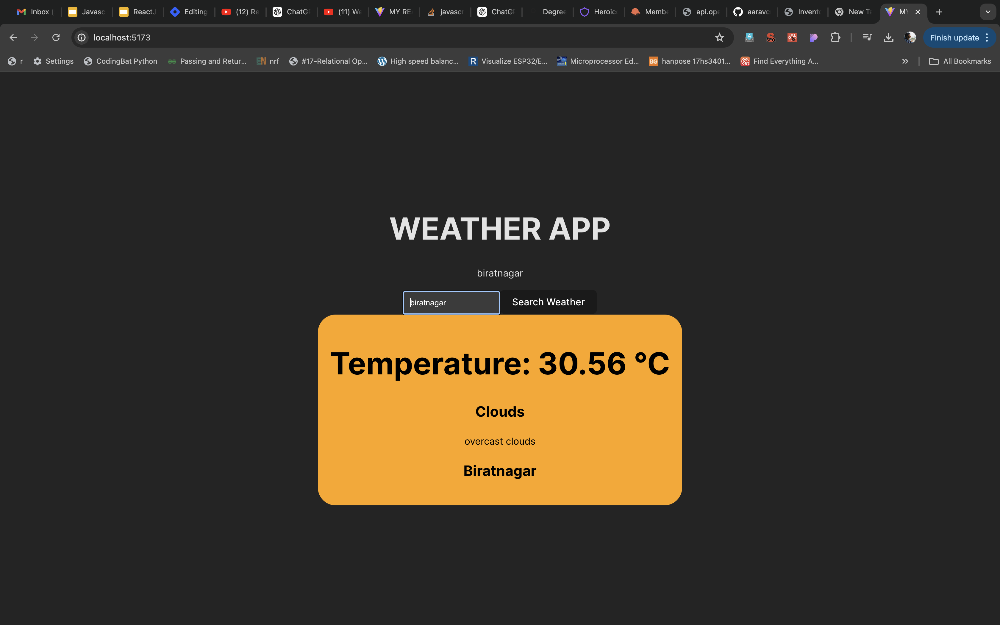

# Introduction to React

## Running this project?

1. Clone this repo `git clone https://github.com/aaravcreator/react_nh.git`
2. cd to project directory `cd react_nh`
3. Run `npm install` and
4. Run `npm run dev`
5. Open `http://localhost:5173` in your browser

## SCREENSHOTS

- [@vitejs/plugin-react](https://github.com/vitejs/vite-plugin-react/blob/main/packages/plugin-react/README.md) uses [Babel](https://babeljs.io/) for Fast Refresh
- [@vitejs/plugin-react-swc](https://github.com/vitejs/vite-plugin-react-swc) uses [SWC](https://swc.rs/) for Fast Refresh
